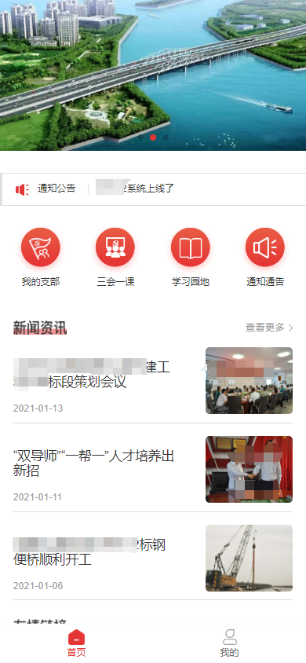

## 项目介绍

`党群建设平台`是为了加强党组织与广大群众之间联系，促进党群之间互动交流、共谋发展的一个重要平台。
它致力于提升党的凝聚力和群众参与度，构建一个互通有无、信息透明、民主参与的桥梁，以实现更好的党建和社会发展。
后台使用Java语言开发，使用Springboot框架，前端为h5移动端，使用vue框架开发。
党群建设平台通过运用互联网技术和信息化手段，打破了传统的党群交流限制，为广大党员和群众提供了更加便捷、高效的参与渠道。
这种开放性的交流平台，有利于凝聚共识、发挥群众智慧、解决问题，从而促进了党的建设和社会治理的现代化进程。

## 系统功能列表

| 系统功能 |
|------|
| 门户管理 |
| 新闻资讯 |
| 我的支部 |
| 三会一课 |
| 会员管理 |
| 学习园地 |
| 通知公告 |
| 信息审核 |
| 系统管理 |

## 技术选型

### 后端技术

| 技术                   | 说明                 | 官网                                                 |
| ---------------------- | -------------------- | ---------------------------------------------------- |
| Spring Boot            | 容器+MVC框架         | https://spring.io/projects/spring-boot               |
| Spring Security Oauth2 | 认证和授权框架       | https://spring.io/projects/spring-security-oauth     |
| MyBatis                | ORM框架              | http://www.mybatis.org/mybatis-3/zh/index.html       |
| MyBatisGenerator       | 数据层代码生成       | http://www.mybatis.org/generator/index.html          |
| PageHelper             | MyBatis物理分页插件  | http://git.oschina.net/free/Mybatis_PageHelper       |
| Knife4j                | 文档生产工具         | https://github.com/xiaoymin/swagger-bootstrap-ui     |
| Redis                  | 分布式缓存           | https://redis.io/                                    |
| Docker                 | 应用容器引擎         | https://www.docker.com/                              |
| Druid                  | 数据库连接池         | https://github.com/alibaba/druid                     |
| OSS                    | 对象存储             | https://github.com/aliyun/aliyun-oss-java-sdk        |
| JWT                    | JWT登录支持          | https://github.com/jwtk/jjwt                         |
| Lombok                 | 简化对象封装工具     | https://github.com/rzwitserloot/lombok               |

### 前端技术

| 技术       | 说明                  | 官网                           |
| ---------- | --------------------- | ------------------------------ |
| Vue        | 前端框架              | https://vuejs.org/             |
| Vue-router | 路由框架              | https://router.vuejs.org/      |
| Vuex       | 全局状态管理框架      | https://vuex.vuejs.org/        |
| Element    | 前端UI框架            | https://element.eleme.io/      |
| Axios      | 前端HTTP框架          | https://github.com/axios/axios |
| v-charts   | 基于Echarts的图表框架 | https://v-charts.js.org/       |

## 环境搭建

### 开发环境

| 工具          | 版本号 | 下载                                                         |
| ------------- | ------ | ------------------------------------------------------------ |
| JDK           | 1.8    | https://www.oracle.com/technetwork/java/javase/downloads/jdk8-downloads-2133151.html |
| Mysql         | 5.7    | https://www.mysql.com/                                       |
| Redis         | 7.0    | https://redis.io/download                                    |
| nginx         | 1.22   | http://nginx.org/en/download.html                            |

## 运行效果展示

### 小程序端

- 首页

- 我的支部

- 三会一课

- 学习园地

- 登录注册

- 后台管理

### 技术支持或联系获取源码
请加QQ: 1062280320

